# 2026sp-BB-M8

  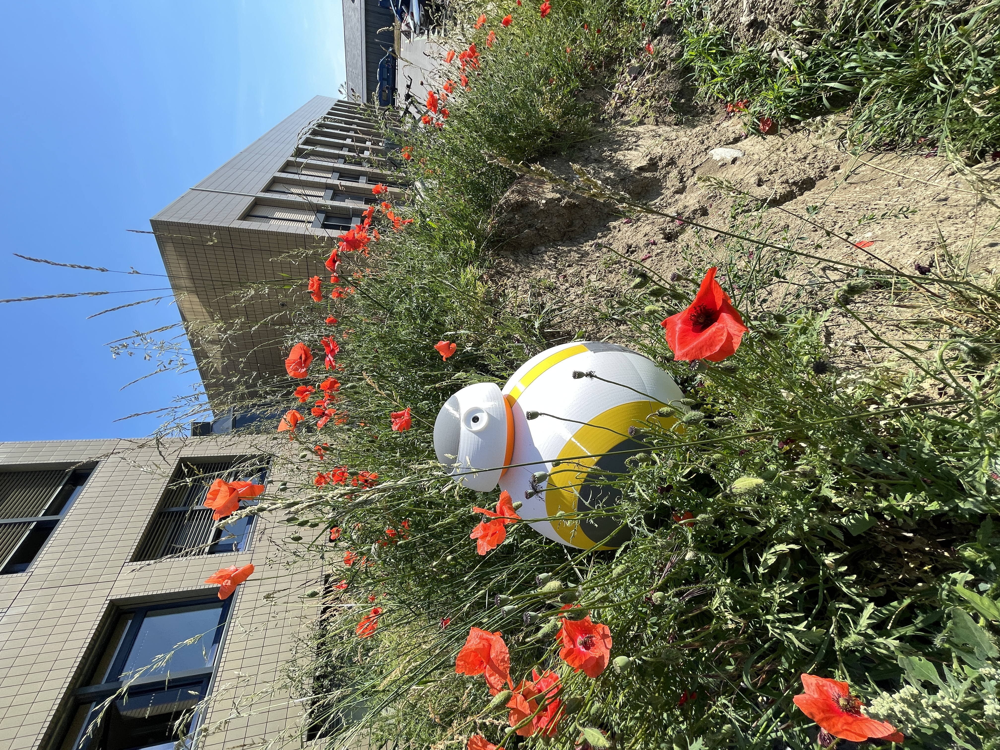

## Contributors

* [Bernadette Orglmeister](https://github.com/boerniii)
* [Noa Cuccodoro](https://github.com/noa-ccdr)
* [Gaspard Héliot](https://github.com/gheliot)
* [Khadija Kammoun](https://github.com/khka5)
* [Gaël Diep](https://github.com/Damedane)
* [Jérôme Essola Elanga](https://github.com/Jess-lnga)

## Table of Content

- [2026sp-BB-M8](#2026sp-bb-m8)
  - [Contributors](#contributors)
  - [Table of Content](#table-of-content)
  - [Project overview](#project-overview)
    - [About the BB-M8](#about-the-bb-m8)
    - [List of Materials](#list-of-materials)
      - [Buy:](#buy)
      - [3D print:](#3d-print)
      - [Laser cut:](#laser-cut)
  - [Built the BB-M8](#built-the-bb-m8)
    - [Head](#head)
      - [Building the mechanical part:](#building-the-mechanical-part)
      - [Electronic Assembly of the head:](#electronic-assembly-of-the-head)
    - [Axis](#axis)
      - [Building the mechanical part:](#building-the-mechanical-part-1)
    - [Main Body](#main-body)
      - [Building the mechanical part:](#building-the-mechanical-part-2)
    - [Swinger](#swinger)
      - [Building the mechanical part:](#building-the-mechanical-part-3)
      - [Electronic Assembly of the swinger:](#electronic-assembly-of-the-swinger)
    - [Pole](#pole)
      - [Building the mechanical part:](#building-the-mechanical-part-4)
    - [Final assembly of the interior body](#final-assembly-of-the-interior-body)
      - [Building the mechanical part:](#building-the-mechanical-part-5)
      - [Electronic Assembly of the interior body:](#electronic-assembly-of-the-interior-body)
    - [Sphere](#sphere)
      - [Builting the sphere](#builting-the-sphere)
  - [Controlling the BB-M8](#controlling-the-bb-m8)
    - [Flashing the code](#flashing-the-code)
      - [Body (Wemos D1 R32 ESP32)](#body-wemos-d1-r32-esp32)
      - [Head (ESP32-CAM)](#head-esp32-cam)
      - [Uploading the dashboard (SPIFFS)](#uploading-the-dashboard-spiffs)
    - [Steering the BB-M8](#steering-the-bb-m8)
      - [Connecting](#connecting)
      - [Dashboard overview](#dashboard-overview)

## Project overview
### About the BB-M8
The BB-M8 is a spherical robot capable of moving across flat surfaces. This is achieved by means of an axis fitted with a pendulum, which can shift the centre of gravity, enabling the robot to navigate curves and maintain stability. The sphere also features a head, which is attached to the body by magnets and always remains on the upper surface of the sphere. The head is equipped with a camera and a rotating mechanism, allowing it to look in all directions. 

The BB-M8 can be connected to any computer via Wi-Fi and controlled from there via an interface, where you can also view the live feed from the camera.

Our BB-M8 is a replica of BB-8 from Star Wars.
The body has a diameter of approximately 35 cm, so a bit smaller than the original one.

### List of Materials
Here is an exhaustive list of all the elements needed to build the BB-M8. Note that you will need a 3D-printer with PETG filament to print some parts and a laser cutter.

#### Buy:
| Electronic Component | Model | Quantity |
|-----------|---------------------------|-----|
| Microcontroller | Wemos D1 R32 ESP32 | 1 |
| Microcontroller | AIThinker ESP32-CAM | 1 |
| Buck Converter | LM2596 | 2 |
| Stepper Motor | 28BYJ-48 | 1 |
| Motor Driver | ULN2003 | 1 |
| Servo Motor | DS3240 | 1 |
| Stepper Motor | NEMA 17 (17HS4401) | 1 |
| Motor Driver | TMC2208 | 1 |
| BMS 3S | HW-544 3S (11.1V/12.6V) BMS | 1 |
| BMS 2S | 2S 20A 18650 Lithium Battery Protection Board | 1 |
| LiPo | Conrad Energy 3S 11.1V 5000mAh | 1 |
| LiPo | LemonRC 2S 7.4V 350mAh | 1 |
| ON / OFF Switch | — | 2 | 
| Gearbox | 10:1 NEMA 17 gearbox | 1 |
| IMU | MPU-9250 | 1 |
| USB-to-TTL serial adapter | FTDI FT232R (HW-417-V1.2) | 1 |

| Other Parts | Specifications | Quantity |
|-----------|---------------------------|-----|
| Aluminium rod | 10 mm diameter, 310 mm length | 1 |
| Big Ball Bearings | 35 × 10 × 11 mm | 2 |
| Small Ball Bearing | 3 x 10 x 4 mm | 1 | <!-- TODO: What bearing is in the swinger -->
| Small Magnets | 5mm diameter, 4 mm height | 8 |
| Big Neodymium Magnets | 20 mm diameter, 12 mm height | 4 |
| Magnets for Bottom of Head | 14 mm diameter, 18 mm height | 4 |
| Wheels | 13 mm diameter | 4 |

- You will also need a **USB Isolator** to protect your computer and **data cables** to flash the code. 

- To charge the LiPos, you also need access to a **battery charging station**.
- Screws, nuts, heat-set inserts, jumpers and other basic supply is also needed, as well as tape and glue.

#### 3D print:
Here you can find all the [stl files](3D-Files/stl) that need to be printed with PETG filament. You find further information about the quantities in the specific subparts of building the BB-M8.

<!-- TODO: Uplode the stl file, and make a refernce to them -->

#### Laser cut:
The BB-M8 has also a few parts made of MDF. Here are the [dxf files](3D-Files/dxf). Note that you will need to use **different thicknesses** for the head and the body! Further information can be found in the corresponding section.
<!-- TODO: Uplode the dfx file, and make a refernce to them -->

## Built the BB-M8
Here are the instructions for building the BB-M8. Note that points having 🫟 in front of it, are further suggestions to make it cleaner and/or to remove unnecessary holes, for example, that are no longer needed.

Here you can find the [step file](3D-Files\FullAssembly.step) of the BB-M8.

### Head
<!-- TODO: Foto of the entire head -->
<!-- TODO: Describtion of the head and its functioning -->

https://github.com/user-attachments/assets/d43b33c3-5c80-41d6-bc25-aa63da8808fc

The head contains the ESP32-CAM with a camera and has an internal rotation mechanism, to make it turn. Another important aspect of the head is its iconic look and its size relative to the sphere, that makes our BB-M8 resemble the original one. 

  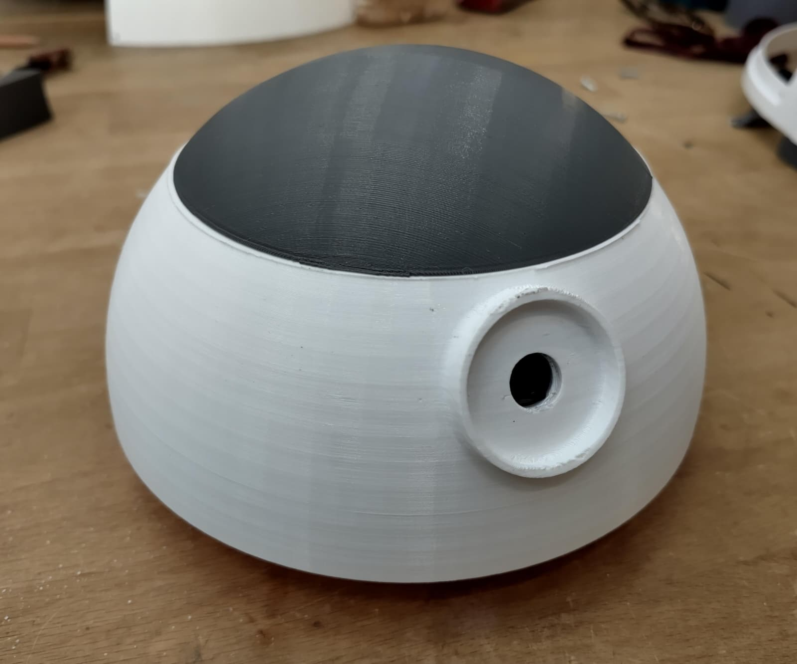
  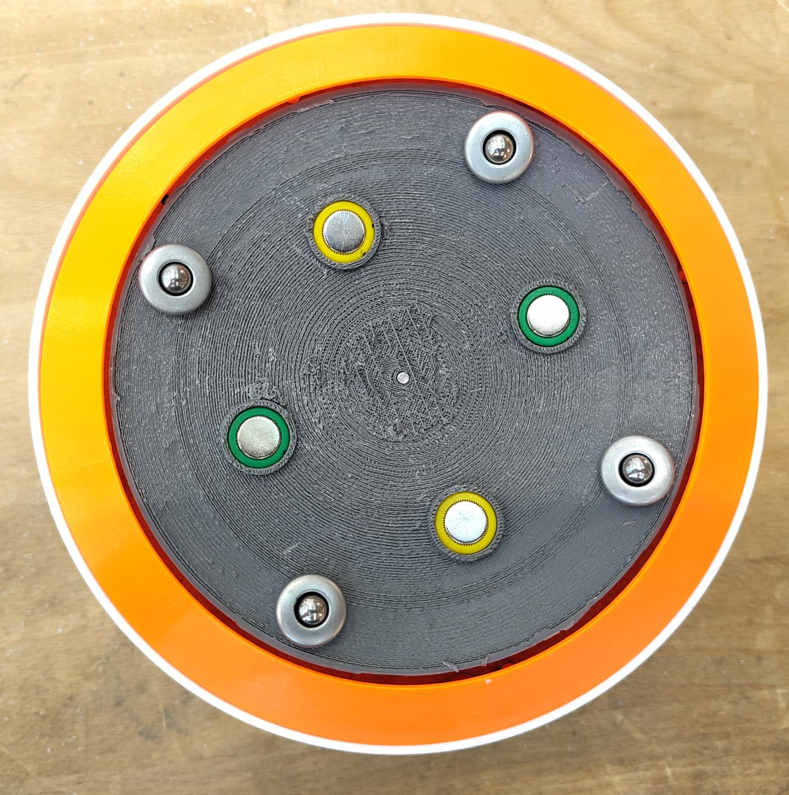

#### Building the mechanical part:
The head is divided into different elements: the lid, the bottom plate (holding the magnets), the top plate (where the components are attached) and the manchette (hiding the bottom plate). 

1. Bottom plate:
    - Print the [bottom Plate](3D-Files/stl/Head_BottomPlate.stl) with PETG filament.
    - Add the **three heat-set inserts**.
    - Screw the [gear](3D-Files/stl/Head_GearBottomPlate.stl) to it.
    - Put the magnets and the wheels into the holes.
    - 🫟 The bottom plate and the gear can be printed in one piece. 

2. Lid: 
    - Print the [bottom of the lid](3D-Files/stl/Head_BottomPartLid.stl) and two times the [top of the lid](3D-Files/stl/Head_TopPartLid.stl).
    - Screw the two top parts together.
    - Then screw it to the rest of the lid.
    - Glue the small magnets into the holes. 
    - 🫟 The holes where the top is connected to the bottom do not perfectly line up, so if you want to have it more beautiful, change it.
    - 🫟 Theoretically, the lid could be printed in one piece with the front side of the ESP32 Holder directly attached to it. 

3. ESP32 Holder:
    - Print the two parts of the ESP32 Holder, [front](3D-Files/stl/Head_ESP32HolderFrontSide.stl) and [back](3D-Files/stl/Head_ESP32HolderBackSide.stl).
    - Add three heat-set inserts into the holes.
    - Then glue it into the lid, so that the holes for the camera line up.
     
4. Top Plate:
    - Laser cut the [top plate](3D-Files/dfx/Head_TopPlate.dxf) with the [stepper holder](3D-Files/dfx/Head_TopPlateStepper.dxf) and two times its [side](3D-Files/dfx/Head_TopPlateSides.dxf) using **4mm MDF**.
    - Glue the parts together.
    - Glue small magnets into the four holes at the edge.
    - Glue a small ball bearing into the hole in the middle, **pay attention that no glue drips into the bearing!**
    - Once the [electronic assembly](#electronic-assembly-of-the-head) is done, screw it onto the plate.
        - Make sure that the screws don't interfere with the magnets and wheels of the bottom plate.
        - Before attaching the stepper, make sure to print and add the [gear](3D-Files/stl/Head_GearForStepper.stl) and also depending on the size of the screw head, carve the edges so that they are not in the way of the gear.
    - Add a bit of velcro to the LiPo and the counterpart to the plate.

5. Final Assembly:
    - Print and then glue the [ball bearing stopper](3D-Files/stl/Head_BallBearingStopper.stl) to a small rod (that fits the ball bearing perfectly). Then slide it through the ball bearing and into the gear of the bottom plate, line it up with the other gear and then attach it with a screw. 
    - 🫟 The attachment of the bearing can be done more properly by using rings and creating a shaft. <!-- TODO: Better explenation -->

6. Manchette:
    - Print the [manchette](3D-Files/stl/Head_Manchette.stl)
    - Add four M2.5 heat-set inserts into the four holes.
    - Screw it to the top plate.

Now the head can be easily opened and closed with the magnets!

    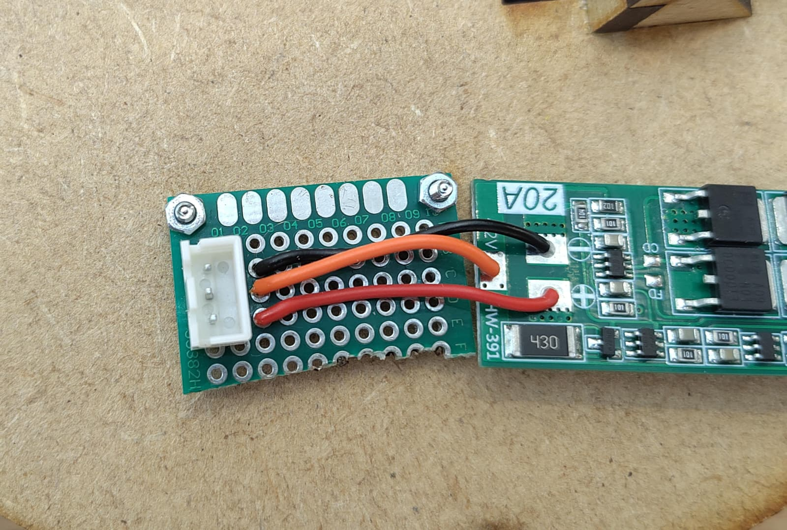
    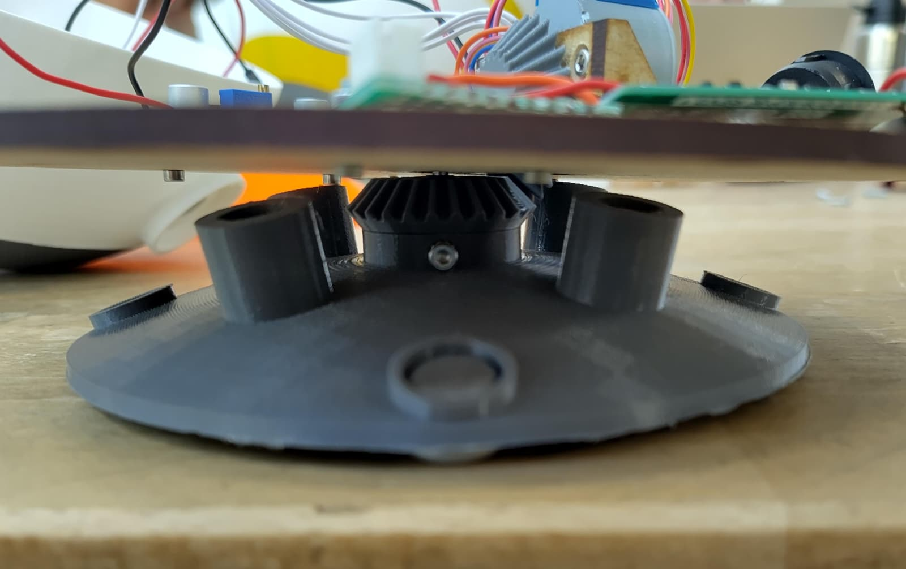
    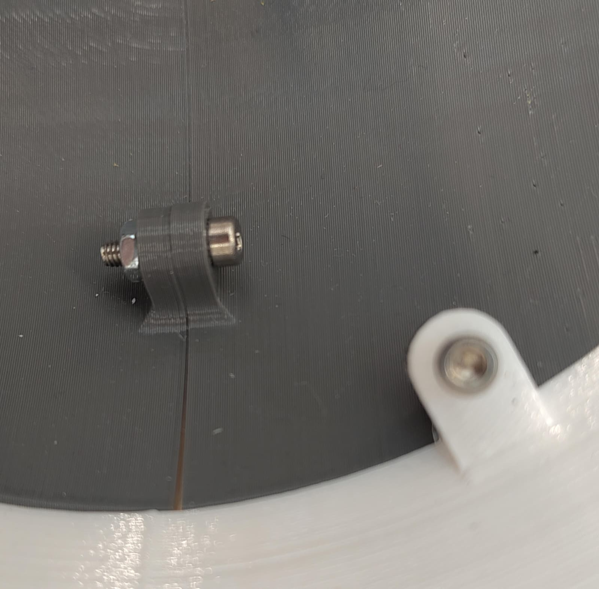
    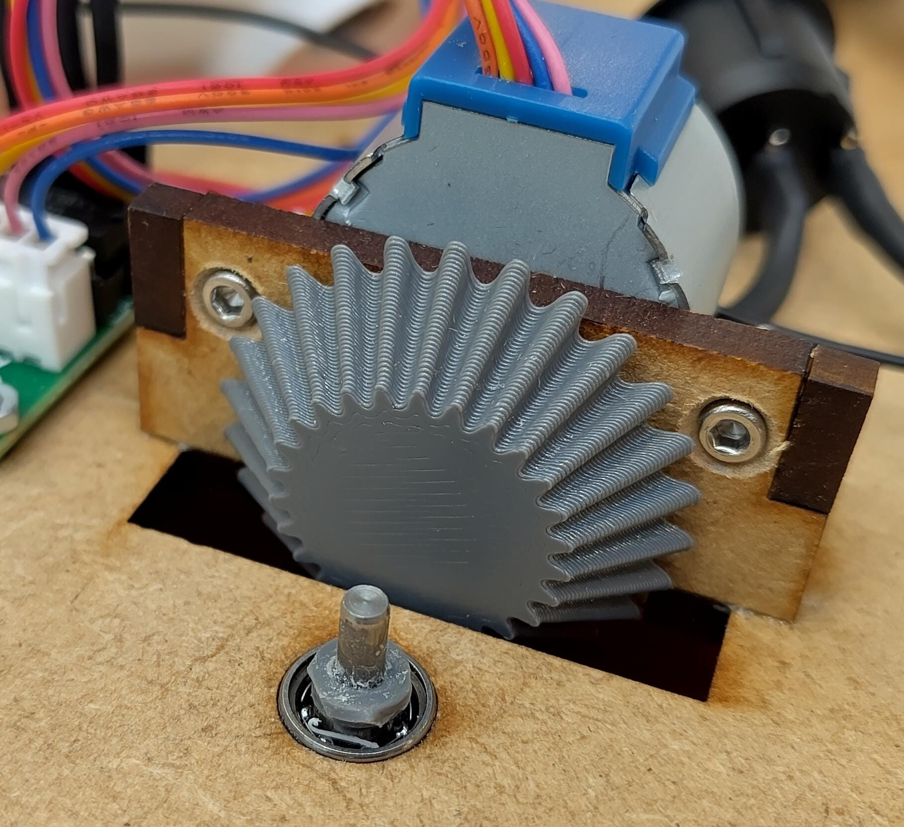

    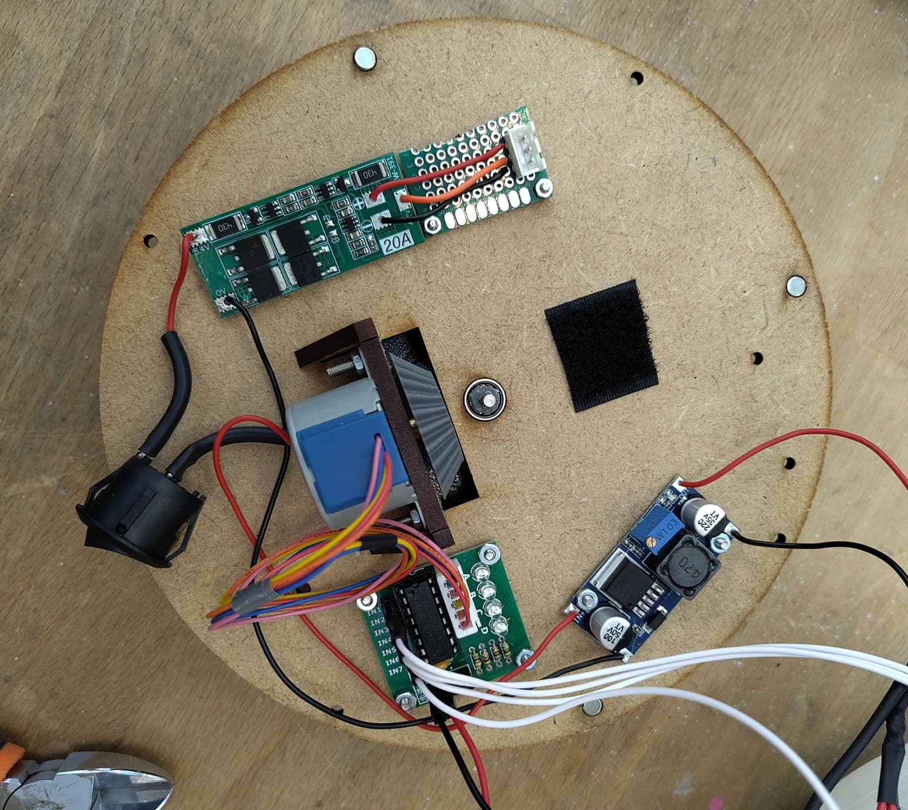
    <!-- TODO: Image of the inside of the lid with EPS32 CAM-->

<!-- TODO: Continue-->

#### Electronic Assembly of the head:

    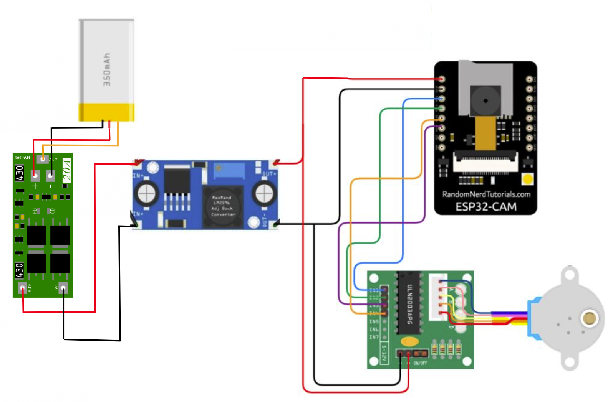

1. Calibrate the **buck converter to 5V**.
2. Solder the connector of the LiPo to the BMS and make sure that it works correctly.
3. Connect the components as in the schematic above. 
    - Make sure that the **cables connecting the ESP32-CAM are long** enough to easily open the lid of the head. 

### Axis
The Axis is the part that will transmit the rotation from the stepper to the sphere. It is made of aluminium to make sure it doesn't bend, it also holds a gear that should be making the axis turn, 2 bearings that will hold the main body and avoid friction, 4 stop rings that will make sure the bearings stay in place, and the box doesn't slip out of the bearing, and finally a junction in 2 parts that will be the attachment of the axis to the body.  

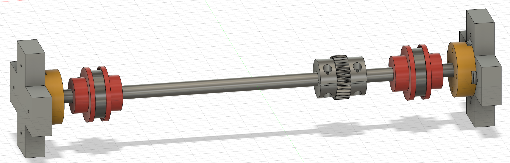

https://github.com/user-attachments/assets/9146e50d-00f2-4c6c-8933-5cecaacd3a80

#### Building the mechanical part:
The axis is divided into different elements: the rod, the gear, the bearings, the stop rings, the first junction, and the second junction. 

1. Rod:
    - Get yourself a 310mm aluminium rod with diameter 10.
    - Drill holes and thread them with a lathe at the two ends of the rod for M2.5 Screws. The holes should be around 5mm deep.
    - Make a 10mm D shape that is 1mm deep at the 2 ends, and make sure the 2 ends have D shapes facing the exact same direction.
    - 🫟 The deepness of the holes, and the length of the D shapes can be a bit bigger and it will totally work. Just don't make them smaller.
    - 🫟 If you need visual support, [here](3D-Files/stl/Axis_Rode.stl) is an STL file, but DO NOT PRINT IT, it won't be resistant enough!  

2. Gear: 
    - 3D Print the [gear](3D-Files/stl/Axis_GearMainPart.stl) and two times the [second part of the gear](3D-Files/stl/Axis_GearSecondPart.stl).
    - Add 4 M2.5 heat-set inserts.
    - With 4 M2.5x16 screws and 4 M2.5 nuts, tighten the gear around the axis.
    - 🫟 For now do not tighten them to the max so that you can easily move it around and find the right position once the main body is done.
    - 🫟 Keep in mind that all the axis will have to be disassembled and reassembled into the actual main body, so this is just to test and make sure all parts work.

3. Bearings:
    - Buy two bearings of size 35x10x11.
    - You'll put them on the rod on each side after adding the two first stop rings (next step).
     
4. Stop rings:
    - 3D print 4 times the [stop rings](3D-Files/stl/Axis_StopRing.stl).
    - Add 4 M2.5 heat-set inserts.
    - With 4 M2.5x16 screws and 4 M2.5 nuts, tighten the stop rings around the axis.
    - Remember to follow the first screenshot to put everything in the right order.

5. First junction:
    - 3D print 2 times the [first junction](3D-Files/stl/Axis_JunctionWithSphere.stl).
    - Put it in the D shape of each end, and screw it to the rod with an M2.5x10.
    - 🫟 If you cannot find a screw that perfectly tightens the junction, just add nuts until it has the desired length (and vary the length of the screw). 

6. Second junction:
    - 3D print 2 times the [second junction](3D-Files/stl/Axis_JunctionToJunction.stl).
    - Just clip it on the first junction.
    

Now the Axis is done, you'll have to disassemble it and reassemble it in the main body once you're sure each component of the axis is well made!

### Main Body
The main body is essentially a wooden box with a few holes to put a Servo, and has the important duty to hold the axis, the NEMA, the pole for the head, and the swinger. It is the centrepiece of the project.  

    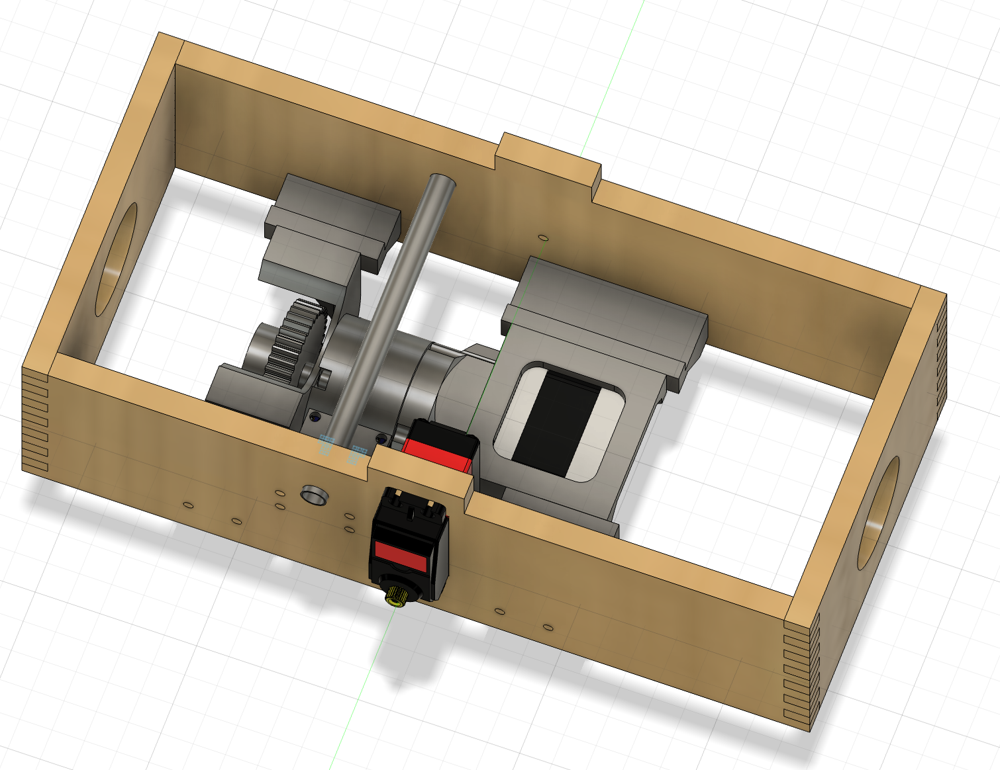
    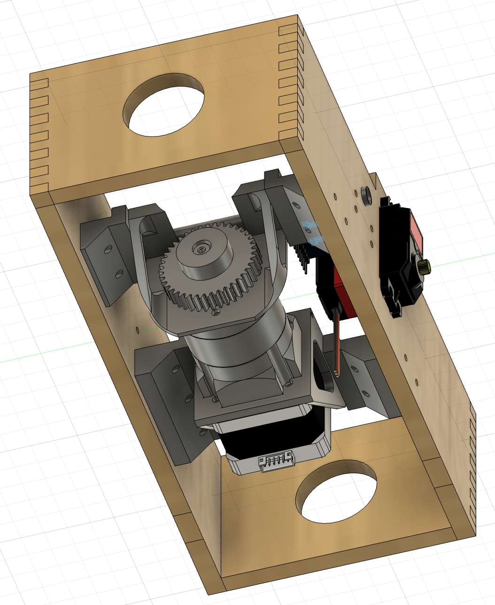
    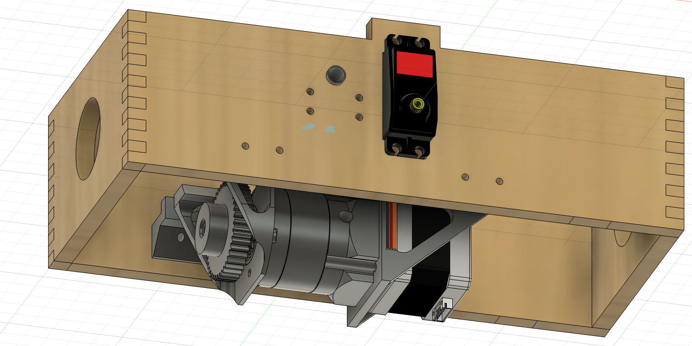

https://github.com/user-attachments/assets/4a70eb73-42a0-409a-afb2-720c48bfd937

#### Building the mechanical part:
The main body is divided into multiple parts: the box, the IMU holder, the two NEMA holders, the stepper and its gearbox, the gear on the gearbox shaft, the Servo, and the pin that holds the second arm of the swinger.

1. Box:
    - On an 8mm thickness sheet of MDF, laser cut one [Large side](3D-Files/dxf/SideBoxLarge.dxf), one [Large side with servo](3D-Files/dxf/SideBoxLargeServoHole.dxf), and two [Sides with holes for axis](3D-Files/dxf/SideBoxWithHoleForAxis.dxf).
    - Then be careful to glue everything together with 90° angles (easier said than done!).

2. IMU holder: 
    - 3D print the [IMU holder](3D-Files/stl/MainBody_IMUHolder.stl).
    - Put it into place with 2 M3x10 screws and 2 M3 nuts. 

3. NEMA holders:
    - 3D print one [NEMA holder Servo side back](3D-Files/stl/MainBody_NemaHolderAttachementServoSide.stl), one [NEMA holder Cap side back](3D-Files/stl/MainBody_NemaHolderAttachementCapSide.stl) and one [NEMA holder](3D-Files/stl/MainBody_NemaHolder.stl). All of these three will attach the NEMA to the center of the box. First assemble this.
    - Then the next three parts are going to prevent the NEMA's shaft from bending and losing the contact between the two gears.
    - 3D print two [NEMA holder front](3D-Files/stl/MainBody_NemaHolderShaft.stl) and one [NEMA holder front screwed](3D-Files/stl/MainBody_NemaHolderScrewed.stl). Assemble these last three pieces together. 
     
4. Stepper & Gearbox:
    - Assemble the NEMA 17 with the Gearbox, and make sure the NEMA Shaft is tightened on the gearbox input.
    - Assemble the NEMA 17 with the NEMA holders using 9 M2.5x10 for the holders themselves, and 9 M3x12 to connect the holders on the MDF box.
    - 🫟 Make sure the socket of the NEMA is looking down.
  
5. Gear shaft:
    - 3D print this [gear](3D-Files/stl/MainBody_GearShaft.stl), make sure you put at least 90% infill to avoid an embarrassing breaking of the gear.
    - Put the gear on the shaft of the gearbox and screw an M3x16 screw with an M3 nut that you're going to fit in the hole extruded for it.

6. Servo:
    - Add the Servo in its hole. Make sure its cables are looking down. 
    - Screw it with 4 M3x12 screws and 4 M3 nuts.  

7. Pin:
    - Buy a pin that is 3mm diameter and 40mm long.
    - Put it inside the hole that is facing the Servo on the opposite side of the box.
    - 🫟 This pin will hold the second arm of the Swinger. 
    

Now the Main Body is done, let's build the Swinger!

### Swinger
The Swinger is a very technical part; it'll hold all the electronics, and swing thanks to the Servo to make the BB-M8 turn and balance. 

    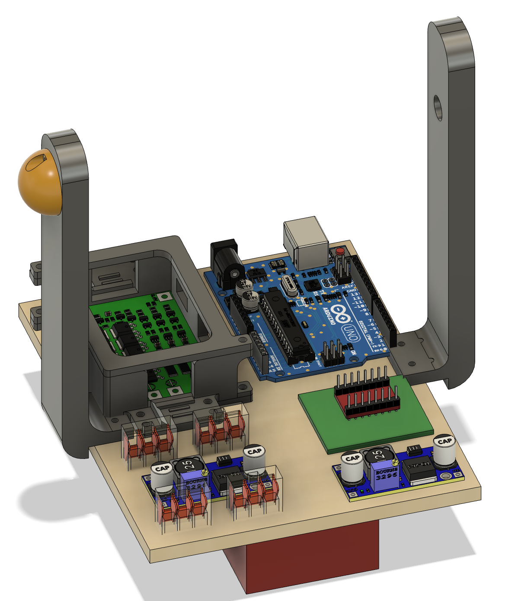
    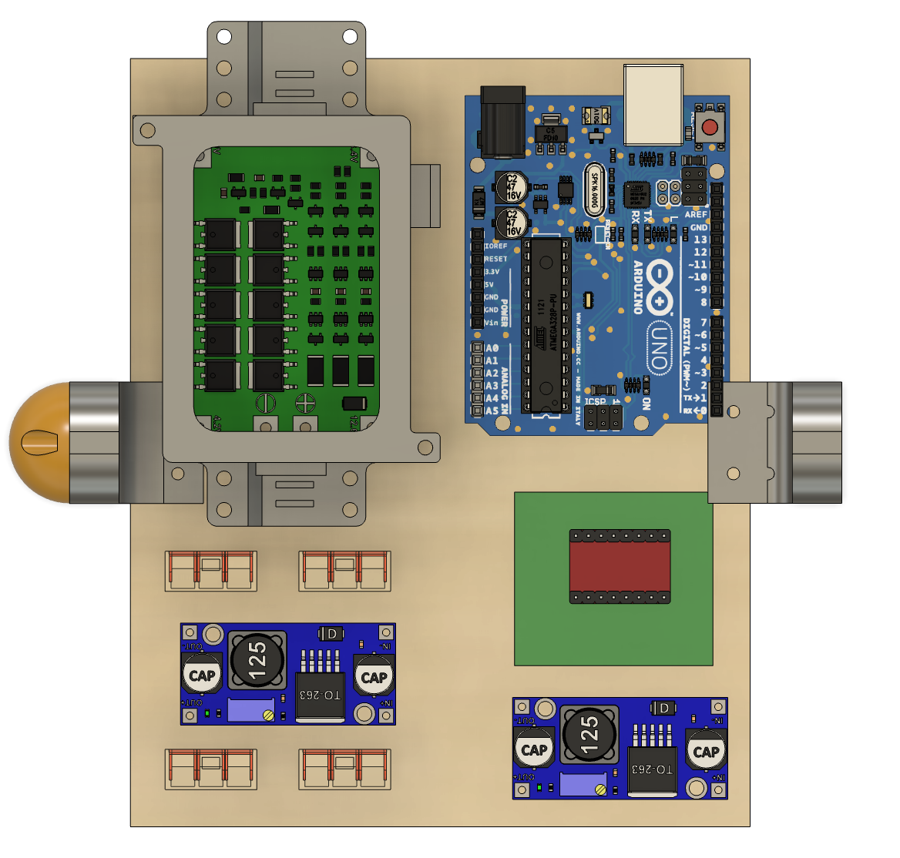
    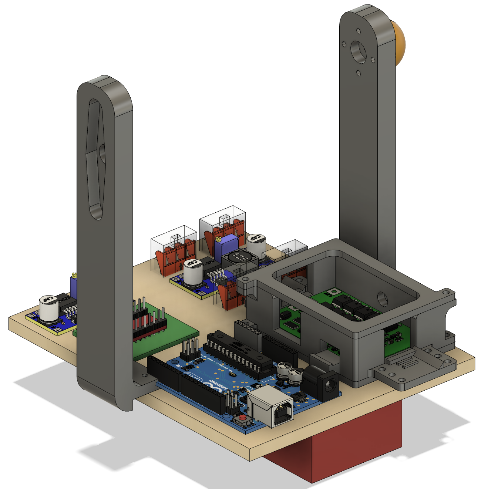

https://github.com/user-attachments/assets/8d093857-c81f-4bc1-969b-20ae95724053

#### Building the mechanical part:
The Swinger is essentially a rectangular MDF sheet with holes to screw all the electronics, velcro under to stick the LiPo, and arms to connect to the main body. It will hold the BMS inside a BMS box, the 2 buck converters, the ESP32, the NEMA's driver, and some wago.

1. MDF Sheet
   - On a 6mm MDF plate, Laser cut this [sheet](3D-Files/dxf/Swinger_Sheet.dxf).
2. BMS Box
   - 3D print the [BMS Box](3D-Files/stl/Swinger_BMSBoxBox.stl) and its [Bottom](3D-Files/stl/Swinger_BMSBoxBottom.stl).
   - After soldering the cables and connectors, put the BMS inside the Box, and screw the box and bottom to the MDF sheet with 2 M2.5x10 screws.
3. Arms
   - 3D print the [Servo arm](3D-Files/stl/Swinger_ArmServo.stl) and the [Cap arm](3D-Files/stl/Swinger_ArmBearing.stl).
   - In the servo arm, put the Servo horn that fits the extruded shape.
   - In the Cap arm, add a 10x3x4 bearing in the extruded cylinder shape.
   - Screw the 2 arms with 2 M2.5x12 and 2 M2.5 nuts for each arm on the sheet of MDF.
4. Cap 
   - 3D print the [Cap](3D-Files/stl/Swinger_ArmCap.stl).
   - Screw it with 2 M2.5x12 and 2 M2.5 nuts on the Cap arm.
5. LiPo
   - Put some velcro under the Swinger and on the LiPo to make them stick. 
6. Weight
   - Add the weight around the LiPo by hot-gluing it.
7. Electronic components
   - Add all the electronic components on the MDF sheet and make sure they are well screwed.
   - 🫟 Remember that the LiPo is right under the electronic components, therefore, there shouldn't be any screws sticking too much out to avoid damaging the LiPo.

#### Electronic Assembly of the swinger:

The swinger hosts all the body electronics. Connect the components as follows:

1. **Power distribution:**
    - The LiPo (3S 11.1V) connects to the BMS, then through the ON/OFF switch to the rest of the circuit.
    - **Buck converter 1** (set to **6V**) → servo DS3240 only.
    - **Buck converter 2** (set to **5V**) → Wemos D1 R32 + TMC2208 driver + IMU.
    - Keeping the servo on its own buck converter prevents it from stealing current from the ESP32 when it moves.

2. **Wemos D1 R32:**
    - Connect the TMC2208 STEP and DIR pins to the dedicated GPIO pins (GPIO 25 and GPIO 26).
    - Connect the servo signal wire to GPIO 18.
    - Connect the IMU (MPU-9250) via I²C: SDA → GPIO 21, SCL → GPIO 22.

3. **NEMA 17:**
    - Connect the four motor wires to the TMC2208 driver outputs.

> Make sure the GND of all components is shared, even across the two buck converters, otherwise the servo PWM signal will not work correctly.

### Pole
The pole is the part that sticks from the main body to hold magnets that will attach the head. 

#### Building the mechanical part:
The pole is divided into three elements: the body attachment, the pole and the magnets holder.

1. Body attachment
   - 3D print the [body attachment](3D-Files/stl/Poll_BodyAttachement.stl), and put an M2.5 heat-set insert inside the hole.
   - Add an M2.5x12 screw.
2. Pole 
   - Cut a 20mm diameter pipe to 135mm (use a pipe type, not a solid rod, the goal is to avoid putting too much weight high up).
3. Magnets holder
   - 3D print the [magnets holder](3D-Files/stl/Poll_MagnetHolder.stl), put an M2.5 heat-set insert inside the hole, then add the M2.5x12 screw.
   - Put the magnets inside, then tape them, and put some hot glue on the back to avoid having the magnets escaping.

### Final assembly of the interior body
Now that you've successfully built each part of the interior of the body successfully, it's time to assemble them.

#### Building the mechanical part:
1. Axis & Main body 
   - Slide the Axis into the Main body, and, when half way sliding it, add all the components of the axis that will be inside the box.
   - It may be slightly difficult to correctly align the two gears, but it is perfectly normal.
   - Make sure to tighten all the screws very well (without breaking the inserts).

    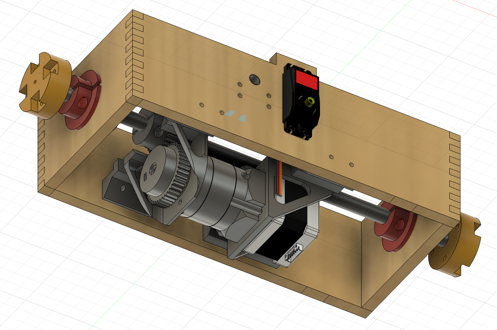
    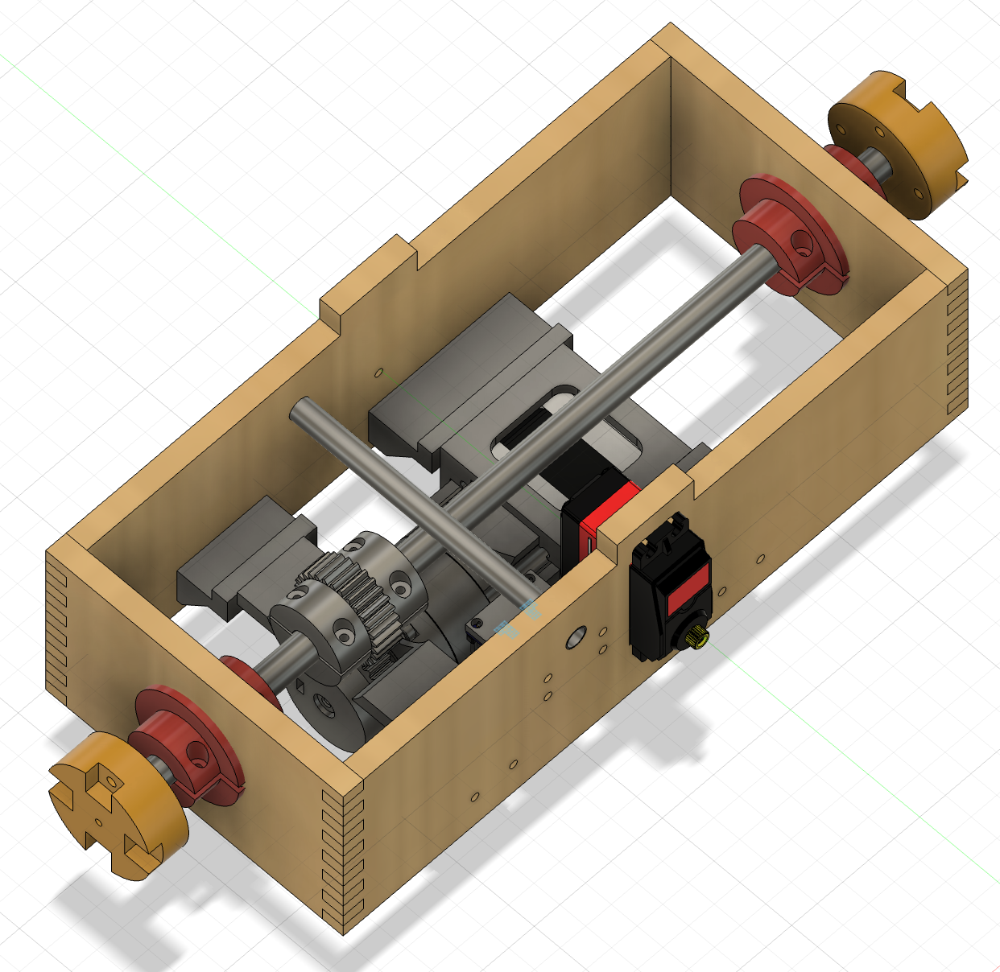

2. Pole
   - Screw the whole pole part to the main body with 4 M2.5x12 screws and 4 M2.5 nuts.
3. Swinger 
   - Connect now the swinger with the rest by clipping the Servo into its horn, and secure it with its screw, and on the other side, slide the pin through the arm cap, and through its bearing.

    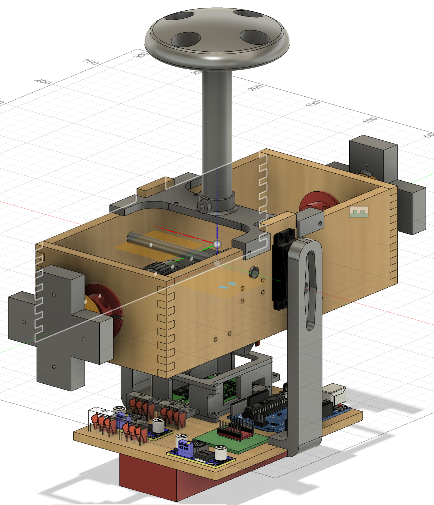
    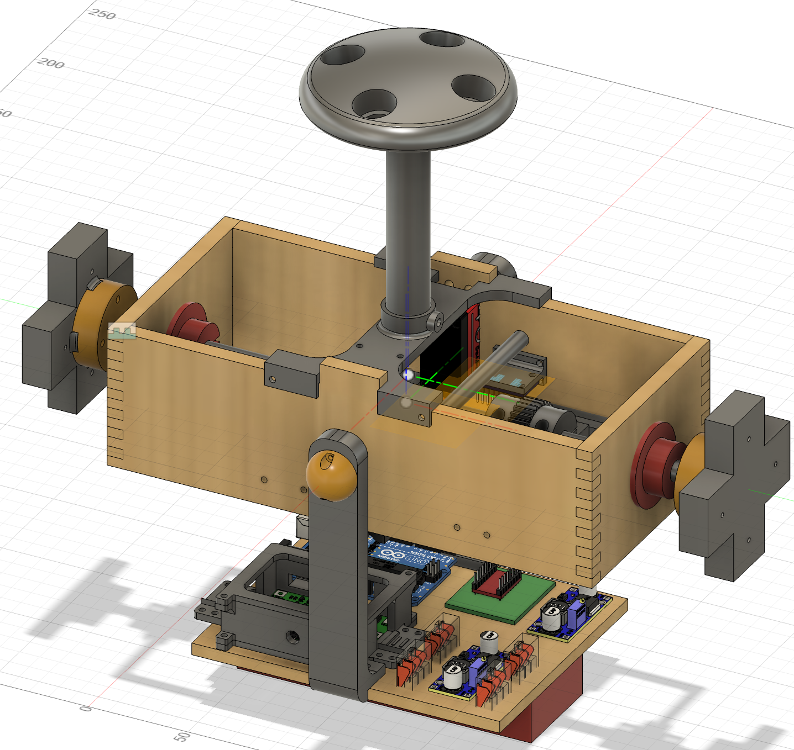

#### Electronic Assembly of the interior body:
1. Servo 
   - Connect the Servo to its dedicated wires.
2. IMU
   - Connect the IMU to its dedicated wires.
3. NEMA
   - Connect the NEMA to its dedicated wires.
4. Cable management
   - Make sure the electronics in the swinger doesn't touch the gear on the shaft of the gearbox at any position of the swinger  
  

You now have the whole interior body. All that's left is to put it inside the sphere, and... voilà!

### Sphere

https://github.com/user-attachments/assets/a65b6fe3-ab26-49d3-bca7-5c9b17b3753b

The sphere itself is 3D-printed in multiple smaller parts so that it can easily be printed on a normal sized Prusa. You need to print the following parts in PETG filament:

| stl file | Quantity |
|-----------|------------|
| [caps](3D-Files/stl/Sphere_Cap.stl) | 2 |
| [bones](3D-Files/stl/Sphere-Bone.stl) | 8 |
| [equator piece](3D-Files/stl/Sphere_Equator.stl)| 4 |
| [top yellow piece](3D-Files/stl/Sphere-TopYellowPart.stl) | 8 |
| [white parts](3D-Files/stl/Sphere_WhitePart.stl) | 6 |
| [opening lid](3D-Files/stl/Sphere_Lid.stl) | 2 |
| [lid surrounding](3D-Files/stl/Sphere_LidSurrounding.stl) | 2 |

Once all parts are printed, glue the pieces together. It is important to keep **1/4 open** so that the inner body still can be placed inside. Also **do not** glue the caps to the rest of the sphere. 

#### Builting the sphere
 1. 3D-Print all the parts.
 2. Glue the pieces together with hot glue.
    - It is important to keep **1/8 open** so that the inner body still can be placed inside.
    - **Do not** glue the caps to the rest of the sphere. 
 
3. Place the [main body](#main-body) inside and make sure that it has enough space.
4. Put the second cap on top, close the last part and attach it with tape.

    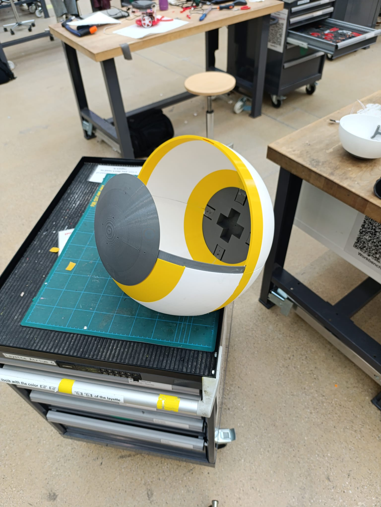

<!-- TODO: Photo of closed sphere-->

## Controlling the BB-M8

### Flashing the code

You will need [PlatformIO](https://platformio.org/) installed in VS Code to flash both microcontrollers.

#### Body (Wemos D1 R32 ESP32)

The Wemos has a native USB port — no adapter needed.

1. Connect the Wemos to your computer via USB.
2. Open the `BBM8_body` folder in VS Code with PlatformIO.
3. Click **Upload** or run `pio run --target upload` in the terminal.

#### Head (ESP32-CAM)

The ESP32-CAM has no native USB port. You need a **FTDI FT232R USB-to-TTL adapter** to flash it.

**Wiring (FTDI → ESP32-CAM):**

| FTDI | ESP32-CAM |
|------|-----------|
| TX   | U0R (RX)  |
| RX   | U0T (TX)  |
| 5V   | 5V        |
| GND  | GND       |

Also connect **IO0 → GND** on the ESP32-CAM to enable flash mode. **Remove this wire after flashing.**

1. Wire the FTDI to the ESP32-CAM as above.
2. Open the `BBM8_head` folder in VS Code with PlatformIO.
3. Click **Upload**. When you see `Connecting......` in the terminal, press the **RST** button on the ESP32-CAM.
4. Once the upload is complete, disconnect IO0 from GND and press RST again.

#### Uploading the dashboard (SPIFFS)

The web dashboard (`BBM8_head/data/index.html`) is stored on the ESP32-CAM's filesystem and must be uploaded separately from the code.

1. Keep the FTDI connected.
2. In VS Code with PlatformIO, run **Platform → Upload Filesystem Image**, or run `pio run --target uploadfs` in the terminal.
3. The dashboard will now be served at `http://192.168.4.1` every time the head powers on.

---

### Steering the BB-M8

#### Connecting

1. Power on the BB-M8.
2. On your computer or phone, connect to the Wi-Fi network **`BBM8`** (password: `starwars`).
3. Open a browser and navigate to **`http://192.168.4.1`**.

#### Dashboard overview

**Camera feed**
Click **FEED ON** in the top-right corner of the camera panel to start the live FPV stream.

**Movement**
Use the **virtual joystick** to drive BB-M8 — the Y axis controls forward/backward speed, the X axis controls steering. The **arrow keys** on your keyboard work as well.

**Telemetry**
The bottom panel shows 7 live graphs updated at 10 Hz: Roll, Pitch, Drive Speed, PID Output, PID Error, Integral and Derivative.

**PID tuning**
Adjust Kp, Ki, Kd in the right panel and click **Apply Gains** to send them to the robot without reflashing. Starting values: Kp = 0.9, Ki = 0.05, Kd = 0.1.

**Target Roll / Target Speed**
Send a fixed value directly to the robot independently of the joystick. Useful for calibration.

**Safety**
The **STOP** button immediately halts the robot. Click **RESUME** to re-enable.　The robot starts in STOPPED mode for safety reasons.
